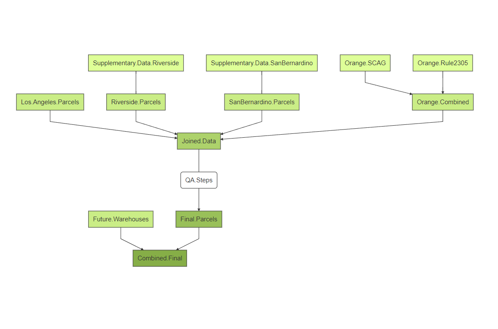

# Warehouse CITY Documentation (beta v1.18 - released January 19, 2024)

## Introduction

The Warehouse CITY (**C**umulative **I**mpact **T**ool for communit**Y**) dashboard is a tool developed to help visualize and quantify the warehouse footprint and environmental impact in Southern California. This dashboard is a result of a collaboration between the Redford Conservancy at Pitzer College and Radical Research LLC. The goal of this tool is to help community organizations understand and quantify the cumulative impacts of existing and planned warehouses. It builds off work done at the Redford Conservancy and published in the [Los Angeles Times](https://www.latimes.com/opinion/story/2022-05-01/inland-empire-warehouse-growth-map-environment).

## Navigating the tool

**Figure 1** shows an annotated layout of the dashboard that maps to the sections below.  

  
*Figure 1. Annotated Dashboard*

### 1. User Interface

#### Jurisdictions Selection Menu

The dropdown menu allows the user to select and display the jurisdictional boundary of cities, unincorporated counties, and land-use authorities in the four county region. Jurisdiction names are alphabetical and can be manually selected or typed into the box. Once selected, the city selection will filter the summary stats table and selection radius to only include warehouses within the selected jurisdictional boundaries. Jurisdictions can be "unselected" by deleting the named selection. Jurisdictional boundaries were obtained from California's [Open Data Portal](https://data.ca.gov)  November, 2022 and Southern California Association of Government's [SCAG](https://gisdata-scag.opendata.arcgis.com/datasets/27b134459761486991f0b72f8a9a67c5_0) city boundary list.  

Alternatively, users can now select California state legislative districts for state assembly and state senate districts.  District boundaries are from the [California State Geoportal](https://gis.data.ca.gov/) and reflect 2021 redistricting maps. Assembly and Senate districts that are largely in the four counties are included.  Assembly districts are abbreviated AD and Senate districts are abbreviated SD.  

#### Select warehouses built by

The numeric input allows a user to select subsets of warehouses with build years before a selected year. For example, if the user selects 2011 all warehouses with build years up to and including 2011 are displayed. All warehouses built prior to 1980 are set as 1980 build years for the purpose of this dashboard display but raw data can be provided for build years upon request.  Note that approximately 400 parcels had unknown build years; those can be removed or added to any analysis with a check box button and are set as 1980 for selection purposes in the slider tool. Similarly, the year 2025 is a proxy for planned or approved warehouses that have not yet been built.

#### Circle (radius in km) slider

This slider allows the user to alter the radius of a great circle for selecting all intersected warehouses. Radius distance values are in kilometers. When the user clicks on the map, a gray circle will appear centered on that point. Any warehouses in the map intersecting that circle are selected for the calculation. Any warehouses outside the gray area are still displayed on the map but are not included in calculations. The data tables update to only show the warehouses included in the selection (circle, year range, and city selection). Pressing the **Reset circle** button below the radius slider will remove the circle selection from the map and reset summary stats.

#### Advanced User Input Options 

Selecting the checkbox displays set of numeric input options for advanced users to input user defined values for warehouse floor space, truck trips, and pollution emissions. Altering these values will change the displayed outputs in the summary table above the map.  

##### Floor area ratio

The floor area ratio is the value used to estimate warehouse building square feet from parcel areas. Values between 0.05 and 1 are allowed. The value defaults to 0.55.

##### Truck Trips per 1,000 sq.ft. 

This provides the estimated heavy-duty truck trips generated per 1,000 square feet of warehouse space. The value defaults to 0.67 and values between 0.1 and 1.5 are allowed.

##### Truck trip length (miles)

This provides the average estimated truck trip length in miles. The value defaults to 38 miles per trip and values between 5 and 60 are allowed.

##### Emissions (Diesel PM, NOx, and CO2)

These three inputs provide the fleet-averaged heavy-duty truck emissions per mile. Default values are 2022 EMFAC fleet-average estimates for the SCAQMD.

##### Jobs per acre

This input allows a user to estimate jobs provided by the selected warehouses at prescribed jobs per acre values.  The default value is 8 jobs per acre as estimated by a bottom-up comparison of Inland Empire warehouse jobs and acres in 2023. Values between 4 and 20 are allowed. 

### 2. Summary stats table

Directly above the map is a table that provides summary statistics for the user selected warehouses. The summary table includes the count of warehouses, the acreage of the warehouse footprint, the total warehouse floor space in square feet, the number of estimated daily truck trips, an estimate of the daily diesel PM<sub>2.5</sub>, NO<sub>x</sub>, and CO<sub>2</sub> emissions from those truck trips, and a jobs estimate. The table updates as the user selects different year ranges, clicks on different sections of the map, chooses  jurisdiction(s), or enters advanced user inputs. Note that this estimate does not include car trips to and from warehouses in the emissions calculation, nor does it include truck idling emissions. Finally, it separates estimates for existing warehouses (already built) and planned, approved, or under construction warehouses which aren't yet in service. The details on these calculations are discussed in the Methods section.

### 3. Map

The map can be navigated using point, click, and drag features or by clicking on the zoom plus and minus buttons on the top left corner of the map. At the top right of the map, the imagery can be switched between a street level **Basemap** and aerial **Imagery**. Polygon overlays can be turned on or off by selecting the check boxes for **Warehouses**, **Jurisdictions**, **Circle**, **Rail**, and **CalEnviroScreen**. Clicking within the map draws a gray circle with a user selected radius defaulting to 5 km (~3.1 miles). This circle is used to identify nearby warehouses that are cumulatively affecting the selected area's air quality and truck traffic. The **Rail** layer indicates rail lines and railyards through the open source [OpenRailwayMap](https://www.openrailwaymap.org/) providerTile.

The **Warehouses** overlay provides a red, maroon, and black layer of existing, approved, and CEQA review warehouses. Polygons for planned warehouses were drawn based on publicly available documents from [CEQANET](https://ceqanet.opr.ca.gov/Search/Recent) or city/county environmental documents. These warehouse polygons are for informational purposes only and should be checked on CEQANET to insure that they are up to date and reflect the most up-to-date information on individual projects.

The **CalEnviroScreen** overlay provides a color-coded overlay of census tracts and their associated pollution burden percentile score. These scores are based on the [CalEnviroScreen4.0 methodology](https://oehha.ca.gov/calenviroscreen/report/calenviroscreen-40). Darker colors indicate higher impact of pollution and socioeconomic disadvantage. Mousing over census tracts displays the census tract number, population, and percentile score (0-100). Full details on this layer are in the [CalEnviroScreen4.0 methodology](https://oehha.ca.gov/calenviroscreen/report/calenviroscreen-40).

### 4. Detailed warehouse table

This table below the map provides individual parcel information on selected warehouses from the map. The table columns indicate the assessor parcel number, class which describes the building land-use, the land-use type as classified for display in the "other parcel type" overlay, the year the building was constructed, the building footprint in acres, and an estimate of the indoor floor space area in units of square feet. These columns are by default sorted from largest area descending. Clicking on the arrows next to each column header allows the data to be resorted. The table updates as user selections are changed. Typing into the boxes above the table allows one to filter the selection for different classifications; these table filter options do not update the map.

## Methods 

Data provenance and processing steps to create the open data product are described in the following sections.  The overall data schematic is shown in **Figure 2**.

 
*Figure 2. Data Schematic*

### Data

Parcel data was obtained from publicly available data warehouses maintained by the counties of Riverside, San Bernardino, and Los Angeles. Orange County data assessor data is not publicly available and was obtained through personal communication with OC public works and a specialized query of the SCAG dataset provided in May 2022.

-   [Riverside County Open Data](https://gis2.rivco.org/)
-   [San Bernardino County Open Data](https://open.sbcounty.gov/datasets/countywide-parcels/about)
-   [Los Angeles County Open Data](https://data.lacounty.gov/datasets/assessor-parcels-data-2006-thru-2021/explore)
-   Personal communications with staff at OC Public Works; <https://www.ocpublicworks.com/> and data from SCAQMD Rule 2305b Board Package Appendix C.   

Parcel shapefiles were obtained April 2024 for Riverside and San Bernardino Counties, LA County, and May 18, 2022 for Orange County. Data from the County websites are provided 'as is' and have multiple limitations in their use for this application. For Riverside County, parcels were filtered based on parcel use codes including the words 'warehouse' and 'light industrial'. For San Bernardino County, the following land-use types were selected: warehouse, flex, light industry, and storage; we then excluded the following categories: 'retail warehouse', 'lumber storage', 'mini storage (public)', 'storage yard', 'auto storage yard', 'boat storage yard', 'grain storage', 'potato storage', 'bulk fertilizer storage', and 'mini-storage warehouse'. Los Angeles County parcels were filtered for the land-use category of 'Warehousing, Distribution, and Storage'. 'Open Storage' was not included, even though many shipping containers around the ports are being stored in this class of parcel.

Emissions factor pollution estimates for heavy-duty trucks (GVWR > 8,500 pounds) were generated from a VMT weighted calculation of EMFAC2021 based on Southern California Air Quality Management District fleet specific data for 2022 downloaded from <https://arb.ca.gov/emfac/> on October 23, 2022. Data and methodology for these fleet-average calculations is available upon request.   

### Processing Steps and Calculations

Warehouses were selected for display if their building size was over 1 acre, which our method estimates to be at least 79,200 square feet of total footprint, with a FAR of 0.55. Parcels that are in the _light industrial_ classification were selected for display if their total parcel size was greater than 150,000 sq.ft. Different cutoffs were applied to avoid including large numbers of small parcels that may potentially be misclassified.

Parcel areas as reported in the assessor databases include total square footage of the parcel footprint. Warehouse building space footprints are unlikely to use the full parcel and often require space for parking lots, loading bays, and setbacks that will result in an over-estimate of warehouse square footage. Our default estimate for building floor space is a floor-area ratio (**FAR**) of **0.55**, which is consistent with industrial zoning in some jurisdictions in Riverside County.

Planned and approved warehouses are based on a review of [CEQANET](https://ceqanet.opr.ca.gov/Search/Advanced) industrial projects with MND or EIR documentation from 2020 through 2023 for each of the four counties. Polygons for these projects may be individual warehouses (typical for projects under 400,000 square feet) or warehouse complexes (multiple warehouses - typical for projects with more than 1.5 million square feet). Planned and approved warehouse projects include projects available that are undergoing CEQA review, have been approved, and under construction projects.  This portion of the dataset is a comprehensive look at the regional warehouse growth areas, but individual projects may be rejected or not get built depending on market conditions.  

Default truck trip estimates are based on South Coast Air Quality Management District indirect warehouse source rule requirements for warehouses greater than 100,000 sq.ft. without truck trip counts [Rule 2305](http://www.aqmd.gov/docs/default-source/rule-book/reg-xxiii/r2305.pdf?sfvrsn=15). The alpha version of the dashboard uses the default weighted truck trip rate of 0.67 heavy duty truck trips per thousand sq.ft of building space from Rule 2305. As noted earlier, the assessor database sq.ft. for the parcel has a 0.55 multiplier to the parcel area to estimate the indoor building area. Thus, the calculation for truck trips is shown below.

```
Parcel.Area * FAR * Truck.Trip.Estimate / 1000 = Truck.trips.per.day
```

We note that we do not include any estimates of vehicle idling, which is particularly important for local exposures near warehouses. Thus, these estimates are likely underestimates of total emissions in close proximity to warehouses.

Default Diesel PM (exhaust), NO<sub>x</sub>, and CO<sub>2</sub> emissions are based on year 2022 EMFAC2021 (version 1.0.2) annual emission factors for heavy-duty trucks (GVWR > 8,500 lbs) for the 2022 fleet year for South Coast AQMD region. Diesel PM<sub>2.5</sub> emissions are \~0.0000364 pounds per mile. NO<sub>x</sub> emissions are \~0.0041 pounds per mile. CO<sub>2</sub> emissions are \~2.44 pounds per mile. Vehicle trips were multiplied by a default truck trip distance of 38 miles. The trip distance is based on average truck trip distances for 2021 for San Bernardino from [Streetlight Data](https://www.streetlightdata.com) as provided by San Bernardino County Transportation Authority. 

The final code for calculating the selected warehouses square footage, truck trips, and pollutant emissions is reproduced exactly below. 

```
SumStats <- reactive({
  req(parcelDF_circle())
  
  parcelDF_circle() %>%
    group_by(category) %>% 
    summarize(Warehouses = n(), 'Warehouse Acreage' = round(sum(acreage), 0), 
              Total.Bldg.Sq.ft = round(sum(acreage*input$FAR*43560), -5), .groups = 'drop') %>%
    mutate(Truck.Trips = round(input$TruckPerTSF*0.001*Total.Bldg.Sq.ft ,-3)) %>%
    mutate('Daily Diesel PM (pounds)' = round(input$avgVMT*Truck.Trips*input$DPMperMile,1),
           'Daily NOx (pounds)' = round(input$avgVMT*Truck.Trips*input$NOxperMile, 0),
           'Daily CO2 (metric tons)' = round(input$avgVMT*Truck.Trips*input$CO2perMile*0.000453592, 1)) %>%
    rename('Warehouse floor space (Sq.Ft.)' = Total.Bldg.Sq.ft,  'Daily Truck trips' = Truck.Trips,
           Category = category)
})
```

## Limitations

While the dataset is awesome, it does have a number of limitations. Multiples issues are being investigated or quality assured as we work to improve the utility of this tool.

-   **Classification** - warehouses are a large class of parcels that include many different types of buildings. This analysis tool is meant to specifically characterize warehouses. However, in Riverside and San Bernardino County, a very large fraction of all warehouses are not classified using the words 'warehouse', 'distribution', or 'storage' in the assessor descriptions. Instead, many are classified as *light industrial*, *flex*, and other terms in the assessor databases. While we faithfully represent the description in the assessor dataset, some of the parcels are misclassified to warehouse while others are clearly misclassified as not warehouses. We are actively working to improve the dataset to better represent the use of the building as we visually inspect the dataset and gain local on-the-ground knowledge on individual facilities.

-   **Duplicate records** - some parcel numbers have multiple records for build year which can lead to double-counting area, truck trips, and emissions. When duplicates occur, we are using the earliest build year from the parcel database which may not account for parcel modifications or expansions. Additionally, some parcels in Los Angeles County had multiple parcel numbers associated with the same warehouse; only one parcel number was allowed for these warehouses to avoid double counting. 

-   **Emissions calculations** - emissions are based on a set of emissions factors that do not account for the heterogeneity of truck trips by warehouse type (cold storage, dry storage, distribution facilities, etc.), nor the variability in truck trip distances based on location of the facility. This information is not readily available at the time but could be incorporated in later versions if individual facility information becomes available through the SCAQMD Rule 2305 reporting or other datasets. Moreover, it includes no emissions from light-duty vehicles from workers or other indirect effects of warehouses.  

-  **Planned and Approved Warehouses** - the new planned and approved warehouses list is a comprehensive effort to identify warehouses in the development phase. This includes all CEQANET documents for the four county region from 2018 (when CEQANET reporting became mandatory).  When there are overlays of planned warehouses over existing parcels it is usually due to an industrial infill project replacing an existing warehouse.  All planned and approved projects have a link to the CEQANET environmental documents starting in v1.19 under the 'class' column of the Detailed Table. These polygons represent individually drawn parcel extents from environmental planning documents, but may not represent final project boundaries, especially for larger warehouse complexes.  

-   **Orange County data** - Assessor parcel data is not directly from the assessor's office and is likely less reliable than the other three counties as a result. It is also older and less complete. Orange County data should be considered preliminary.

-   **Idling at warehouses** - No emissions estimate is made for idling of diesel vehicles at warehouses. This may be the largest local impact of warehouses for people living, working, attending school, or exercising adjacent to warehouses. Most jurisdictions have anti-idling rules prohibiting idling for more than 5 minutes, but enforcement is usually complaint-based rather than systematically monitored by the municipality.


-   **Errata**

    -   We are working to improve the parcel information for this entire dataset. If you have any information on individual parcels that you believe are currently misclassified, please contact us at the email below and we'll work to improve our classification.\
    -   A large number (12,000+) of sub 1-acre warehouses are excluded from this analysis as the application slows down significantly when displaying these micro-warehouses. The total area of the warehouses with less than 1-acre buildings is approximately 2.7x10<sup>8</sup> sq.ft.\
    -   No estimate is made for emissions from light-duty vehicle trips of workers commuting to and from warehouses.\
    -   No estimate is made for emissions from light-duty or medium duty vehicle trips of delivery vehicles to and from warehouses.  The cutoff for trucks is GVWR > 8,500 pounds per EMFAC classification.  
    -   San Bernardino "build year" values are now based on [DataTree](https://web.datatree.com/) parcel classifications of build year, rather than 'assessor base year' estimates from the San Bernardino County Open Data shapefiles.  

## Contact and Support

-   If you have questions or suggestions, please email [mikem@radicalresearch.llc](mailto:mikem@radicalresearch.llc){.email}

-   If you are interested in supporting local organizations working on land-use issues, please visit the [Redford Conservancy](https://www.pitzer.edu/redfordconservancy/) and/or [Riverside Neighbors Opposing Warehouses](https://tinyurl.com/RIVNOW).

### Legal Disclaimer

This open data product and the content herein is provided by the copyright holders and contributors 'AS IS', and 'WITH ALL FAULTS' with no guarantee of any kind as to the completeness or accuracy of the information and content and any express or implied warranties of merchantability and fitness for a particular purpose are expressly disclaimed. In no event shall the copyright holders or any contributors be liable for any direct, indirect, special, exemplary, or consequential  damages (including, but not limited to, procurement of substitute goods or services; loss of use, data, or profits; or business interruption) however caused and on any theory of liability, whether in contract, strict liability, or tort (including negligence or otherwise), and whether known or unknown, foreseeable or unforeseeable, arising in any way out of the use of this open data product or any element hereof, even if advised of the possibility of such damage.   
